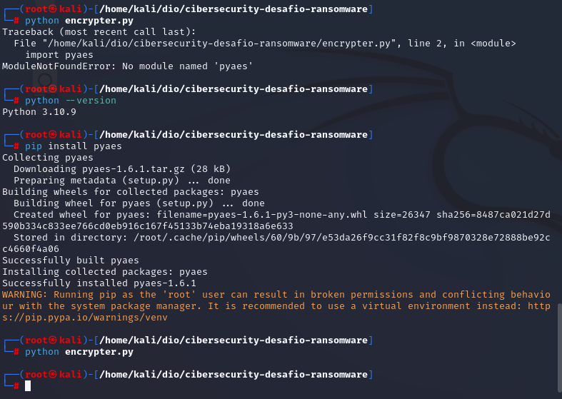
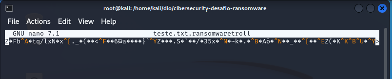

# cibersecurity-desafio-ransomware
Atividade final curso formação Cybersecurity da DIO , usando ransomware com python para criptografar (man in the middle) wireshark \

## para dar certo o projeto precisa ter a lib do pyaes , que precisa ser instalada: pip install pyaes
 \
----------------------------------------------------------------------- \

